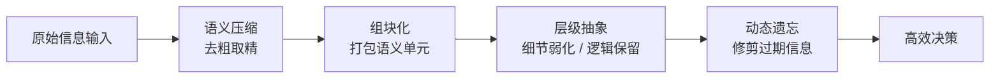
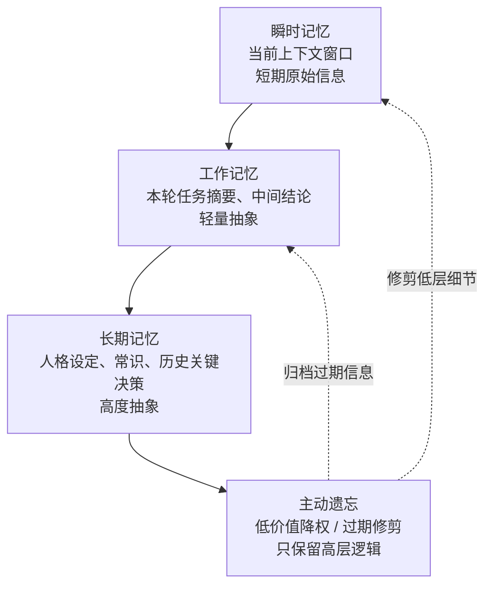

## 一、参数量的「虚假优势」

当我们谈论当前旗舰 AI 模型的参数量时，一个普遍的疑问会随之而来：那些动辄万亿级参数的模型，参数量早已远超人类大脑的 860 亿神经元，为何在智能灵活性、信息处理效率上，依然与人类大脑存在天壤之别？

答案并非参数数量的差距，而在于人类大脑与生俱来的信息压缩、组块化与抽象能力——这既是人脑高效运行的核心密码，也是下一代 AI Agent 实现突破的关键方向。

首先需要纠正一个普遍的认知误区：AI 的参数量并不等同于人类大脑的神经元数量，参数越多也不代表越接近人脑智能。从硬数据对比来看，两者的差距体现在本质层面。

人类大脑的生理基础决定了其高效性：大脑皮层约有 860 亿个神经元，而神经元之间的突触连接（这才是大脑真正的"记忆与权重载体"）高达 **150 万亿条**。更关键的是，人脑是一个高度稀疏、动态连接、可终身重塑的系统，仅需 20 瓦的能耗就能全天高效运行，其短时工作记忆虽有限，却能通过极致的信息处理能力弥补这一短板。

反观当前的旗舰 AI 模型，无论是 GPT-5.5、Gemini 3.1 Ultra 等国际巨头产品，还是 DeepSeek V4-Pro、通义千问 3.5-Max 等国产旗舰，其万亿级的总参数看似远超人脑神经元数量，但存在两个致命局限：一是实际运行时仅激活部分参数（通常为 17B～70B），二是这些参数本质上是静态的矩阵权重，依靠大规模浮点计算暴力拟合数据，能耗巨大且缺乏动态适应性。

更核心的对比在于信息处理逻辑：

| 维度 | 人脑 | AI |
|------|------|-----|
| 存储方式 | 理解→抽象→压缩 | 全文平铺硬存 |
| 工作记忆 | 几十～几百 token | 100万～1000万 token |
| 信息密度 | 提纲挈领式的主动提炼 | 大海捞针式的被动存储 |
| 能耗 | 20 瓦 | 兆瓦级 |

即便 AI 的上下文长度已达到百万甚至千万 token，远超人类短时工作记忆，但其信息处理效率、抽象能力依然被人脑碾压。

## 二、人脑的「省内存密码」

人类大脑之所以能以极低能耗处理海量信息，核心在于其拥有一套高效的信息管理系统，这也是 AI Agent 需要复刻的核心能力，具体可拆解为三大机制。

### 语义压缩

人脑从不存储信息的原始形态，而是自动过滤口语、重复、无关细节，只留存最关键的概念、关系与结论。例如，我们听完一场两小时的会议，不会记住每一句话，却能清晰回忆起会议的核心决议、任务分工与时间节点——这种"去粗取精"的能力，让大脑在有限的记忆容量内承载更多有价值的信息。

### 组块化（Chunking）

心理学中的米勒定律早已证实，人类短时工作记忆的容量仅为 **7±2 个「认知组块」**。这里的「组块」并非单个文字或词语，而是一段有意义的语义单元——比如「今天下午三点在会议室开项目推进会」，就是一个完整的认知组块。通过将零散信息打包成统一的认知单元，人脑能以极少的「记忆容量」承载巨量信息。

实测统计显示，一个中文语义组块的平均长度约为 8～12 个汉字，按中间值 10 个汉字计算，结合 1 token ≈ 0.75 个汉字的换算标准，人类短时工作记忆的极限容量约为 **67～120 token**（高强度专注场景），日常宽松场景下可放宽至 200～300 token，远低于 AI 的百万级上下文，但信息密度却远超 AI。

### 层级抽象 + 动态遗忘

人脑的记忆是分层结构的：低层的细节信息会被逐步弱化，高层的逻辑、概念与核心结论会被重点保留；同时，人脑具备天然的动态遗忘机制，会自动修剪不重要、过期的信息，只留存对决策、认知有价值的内容。这种「分层 + 遗忘」的组合，让大脑始终保持高效运转，避免被冗余信息拖累。

## 三、AI Agent 的复刻之路

令人振奋的是，人脑的这三大核心能力，并非不可复刻——恰恰相反，这正是当前 AI Agent 下一代发展的核心方向。

当前普通 AI 之所以做不到，核心在于其采用「原始平铺式上下文」机制，全文 raw text 硬塞进窗口，没有抽象、没有提炼，导致长上下文成本爆炸、容易遗忘、推理效率低下，就像"用草稿纸裸跑"；而复刻了类脑记忆机制的 AI Agent，则能像人脑一样「用思维导图 + 摘要 + 标签跑」，实现效率的质的飞跃。

目前，顶尖 AI Agent 已经通过成熟的技术栈，逐步复刻人脑的三大能力，且已有落地应用。

### 复刻「语义压缩」：记忆摘要 + 信息蒸馏

工程化的实现方式是，让 AI Agent 在合适的时机（比如每轮对话、每个任务结束后），自动执行「压缩蒸馏」操作：删除口语化表达、重复内容与无关细节，只保留事实、目标、约束条件与关键结论。

例如，一段 10 万字的对话，经过压缩后仅需 3000～5000 token 就能留存核心信息，内存占用直接降低 **95% 以上**，既减少了算力消耗，也避免了信息冗余导致的推理漂移。

### 复刻「组块化」：认知组块 + 向量化聚类

模仿人脑的组块化机制，AI Agent 会将连续的信息按"语义主题"切割、打包，将同类内容聚类为一个「记忆组块」；在检索信息时，不再遍历全文，而是按组块调取，大幅提升检索效率。

对应的核心技术包括语义分块、RAG 主题分片、记忆向量聚类、事件单元封装等，这些技术已成为当前高级 AI Agent 的标配。

### 复刻「层级抽象 + 动态遗忘」：分层记忆系统

顶尖 AI Agent 已开始采用完全对标人脑记忆结构的分层记忆系统：

1. **瞬时记忆**：当前上下文窗口，存储短期原始信息
2. **工作记忆**：本轮任务摘要、中间结论，轻量抽象
3. **长期记忆**：高度抽象的人格设定、常识、历史关键决策
4. **主动遗忘**：对低价值信息降权、归档，对过期细节定期修剪，只保留高层逻辑与核心价值

目前，OpenAI Agent、Claude Agent 已实现自动对话摘要、滚动压缩功能；Hermes、AutoGPT、Dify 等开源 Agent 的高级记忆模式，也已落地分层记忆与记忆蒸馏；企业级自研 Agent 则会根据具体场景，定制组块拆分、概念抽象与关系图谱存储方案，实现更精准的类脑记忆复刻。

## 四、复刻难点：差距仍在「本质」

尽管 AI Agent 已能复刻人脑的三大信息处理机制，但目前仍与人类大脑存在三个核心差距，这些差距也是未来研究的重点方向。

**1. 抽象的「即时性」差异。** 人脑接收信息的瞬间，就能完成自动抽象与压缩，无需额外消耗「算力」；而 AI Agent 的压缩、抽象操作，需要额外增加一轮推理过程，消耗一定的算力，无法实现「即时响应」。

**2. 价值判断的「本能性」差异。** 人类天生具备价值判断能力，能瞬间区分信息的重要性，知道该记住什么、该遗忘什么；而 AI Agent 的价值判断，需要依靠预设规则、权重打分或额外模型辅助，无法像人脑一样「本能反应」。

**3. 动态连接的「可塑性」差异。** 人类大脑的突触连接是动态重塑的，会根据经验、学习不断调整，形成新的认知关联；而当前 AI Agent 的记忆仍以「静态归档 + 检索」为主，无法实时重塑概念关联，灵活性不足。

## 五、AI Agent 的未来：类脑而非堆参

从 AI 参数量与人脑的对比，到人脑压缩抽象能力的拆解，再到 AI Agent 的复刻路径，核心结论是：AI 的未来，不在于无限制堆参数量，而在于向人类大脑学习——放弃无限长 raw 上下文的「暴力路线」，走向**「小窗口 + 强抽象 + 分层记忆」**的类脑路线。

当前，类脑记忆机制的复刻，已经成为 AI Agent 突破长上下文瓶颈、提升推理效率的核心解法。随着技术的不断迭代，当 AI Agent 能真正实现「即时抽象 + 本能判断 + 动态重塑」，其与人类大脑的差距将逐步缩小，最终实现更高效、更灵活的通用智能——而这，正是 AI Agent 从「工具」走向「伙伴」的关键一步。
