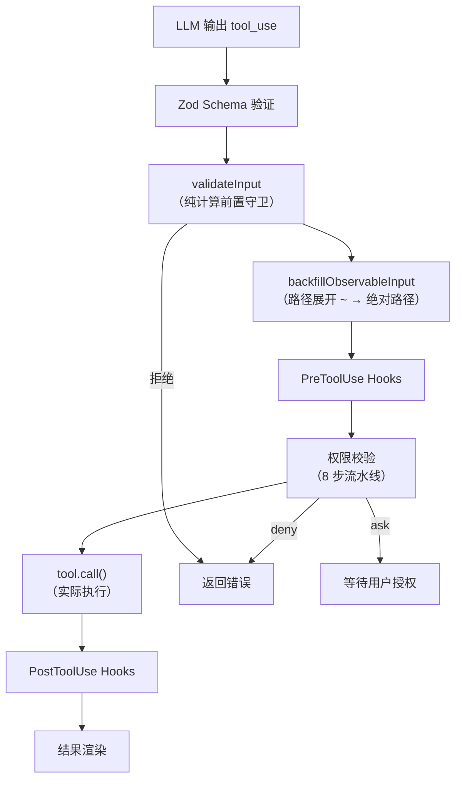
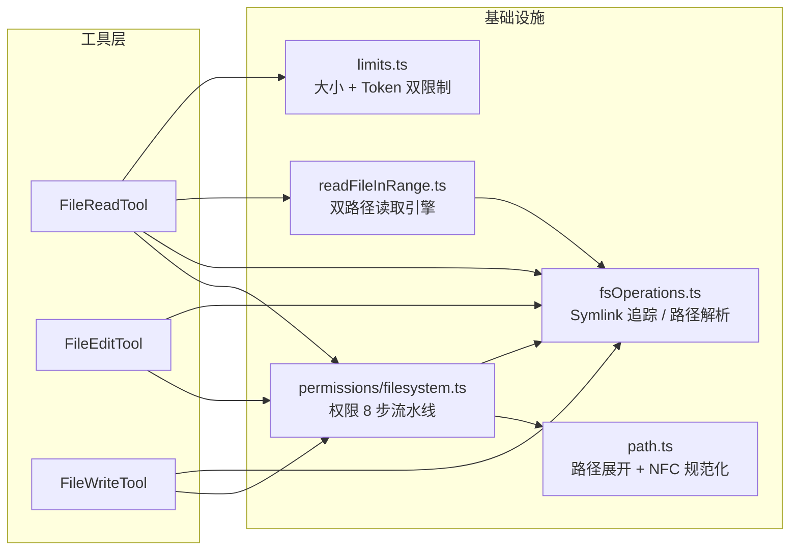

## 零、架构总览

在进入任何细节之前，先看清楚整座建筑的结构。

### 三个工具，三个职责

Claude Code 的文件操作由三个独立工具承担，它们共享权限基础设施，但各自拥有独立的输入校验和执行逻辑：

| 工具 | 源码 | 行数 | 职责 | 关键约束 |
|------|------|------|------|----------|
| `FileReadTool` | `src/tools/FileReadTool/` | 1185 | 读取任意文件 | 只读，永不持久化结果 |
| `FileEditTool` | `src/tools/FileEditTool/` | 627 | 差量替换（old → new） | 必须先读后写，mtime 竞态保护 |
| `FileWriteTool` | `src/tools/FileWriteTool/` | 436 | 全量覆盖或创建新文件 | 可创建新文件，全量写入 |

### 一次文件操作经历了什么

当 LLM 决定读取或编辑文件时，请求经过以下管道：



- **validateInput** 是纯计算守卫，不做 I/O（少数例外如文件存在性检查），在权限检查之前拦截无效请求
- **权限校验** 是最复杂的环节，涉及 deny → ask → allow → 默认拒绝的多步判断，且需追踪 symlink 链
- **tool.call()** 是实际执行层，三个工具各有独立实现

### 核心依赖关系



### 共享状态：readFileState

三个工具通过 `readFileState`（一个 `Map<filePath, {content, timestamp, offset, limit}>`）实现隐式协作：

- **FileReadTool 写入** — 读取后记录内容、mtime、offset/limit
- **FileEditTool 读取 + 更新** — 编辑前检查"是否读过"，编辑后更新内容和 mtime
- **dedup 机制** — 重复读取同一文件（mtime 未变）时返回 `file_unchanged`，节省 ~18% 的 Read 调用

### 设计哲学的三条主线

理解后续所有细节的钥匙：

1. **Fail-closed（默认拒绝）** — 没有明确允许的路径一律拒绝，deny 规则优先级最高
2. **Defense in depth（分层防御）** — 权限规则 → 路径规范化 → 内容限制 → 操作原子性，任何单层被突破都不致命
3. **平台兼容优先于代码简洁** — macOS 截图窄空格、Windows UNC 路径、NFC 规范化……大量代码在处理边界条件而非核心逻辑

带着这三条线，进入细节。

---

## 一、从 buildTool 说起：工具的构造元

所有文件工具的起点不是 `class extends Tool`，而是 `buildTool` 工厂函数。它用 TypeScript 的 `satisfies` 运算符做编译期约束——你必须提供正确的字段，但不必提供全部：

```typescript
export const FileReadTool = buildTool({
  name: FILE_READ_TOOL_NAME,
  maxResultSizeChars: Infinity,  // 关键：读结果永不持久化
  strict: true,
  isConcurrencySafe() { return true },
  isReadOnly() { return true },
  // ...
} satisfies ToolDef<InputSchema, Output>)
```

**`satisfies` vs `implements`**：`satisfies` 检查类型兼容但不改变推断类型，这意味着工具的返回类型保持精确的判别联合（discriminated union），下游代码可以直接 `switch(data.type)` 而不必做类型断言。如果用 `implements`，返回类型会被展平为基类接口，丧失穷尽性检查。

## 二、validateInput：纯计算的前置守卫

`validateInput` 在权限检查之前执行，且承诺**不做 I/O**（除了 UNC 路径提前返回和文件存在性检查）。这是一个关键设计：I/O 操作在权限检查之前是危险的——用户还没同意，你就不能碰磁盘。

### FileReadTool 的 validateInput：6 道关卡

```typescript
async validateInput({ file_path, pages }, toolUseContext) {
  // 第 1 关：PDF 页码参数纯字符串校验
  if (pages !== undefined) {
    const parsed = parsePDFPageRange(pages)
    if (!parsed) return { result: false, message: '...', errorCode: 7 }
    if (rangeSize > PDF_MAX_PAGES_PER_READ) return { result: false, errorCode: 8 }
  }

  // 第 2 关：路径展开 + deny 规则（无 I/O）
  const fullFilePath = expandPath(file_path)
  const denyRule = matchingRuleForInput(fullFilePath, ..., 'read', 'deny')
  if (denyRule !== null) return { result: false, errorCode: 1 }

  // 第 3 关：UNC 路径提前放行（避免触发 SMB 认证）
  if (fullFilePath.startsWith('\\\\') || fullFilePath.startsWith('//'))
    return { result: true }  // 交给权限系统处理

  // 第 4 关：二进制扩展名检查（纯字符串匹配）
  if (hasBinaryExtension(fullFilePath) && !isPDFExtension(ext) && !IMAGE_EXTENSIONS.has(...))
    return { result: false, errorCode: 4 }

  // 第 5 关：设备文件黑名单（防止进程挂起）
  if (isBlockedDevicePath(fullFilePath))
    return { result: false, errorCode: 9 }

  return { result: true }
}
```

**设备文件黑名单**的设计值得细看：

```typescript
const BLOCKED_DEVICE_PATHS = new Set([
  '/dev/zero',    // 无限输出 — 永远到不了 EOF
  '/dev/random',  // 同上
  '/dev/urandom', // 同上
  '/dev/full',    // 同上
  '/dev/stdin',   // 阻塞等待输入
  '/dev/tty',     // 同上
  '/dev/console', // 同上
  '/dev/stdout',  // 读 stdout 毫无意义
  '/dev/stderr',  // 同上
  '/dev/fd/0', '/dev/fd/1', '/dev/fd/2',  // stdio 的 fd 别名
])
```

注意 `/dev/null` 被故意排除——读 `/dev/null` 立即返回空内容，无害且有时有用。这种**白名单而非黑名单**的思路在安全系统中不常见，但在这里是合理的：设备文件的数量有限，穷举危险的比穷举安全的更容易。

### FileEditTool 的 validateInput：先读后写的强制执行

FileEditTool 的 validateInput 比 FileReadTool 复杂得多，因为它必须保证**"先 read 再 edit"** 的不变量：

```typescript
// 检查 readFileState 中是否有该文件的记录
const readTimestamp = toolUseContext.readFileState.get(fullFilePath)
if (!readTimestamp || readTimestamp.isPartialView) {
  return {
    result: false,
    behavior: 'ask',
    message: 'File has not been read yet. Read it first before writing to it.',
    errorCode: 6,
  }
}
```

`readFileState` 是一个跨工具共享的 Map，键是文件的绝对路径，值包含 `content`、`timestamp`（mtime）、`offset`、`limit`。当 FileReadTool 读取文件时写入，FileEditTool 写入文件后更新。这意味着**编辑结果自动进入 readFileState**，后续对同一文件的读取会触发 dedup。

**`isPartialView` 标志**：如果上次读取只读了文件的一部分（指定了 offset/limit），`isPartialView` 为 true，此时不允许编辑——因为你没看到文件全貌，盲目编辑可能破坏未读部分的内容。

## 三、权限校验：8 步流水线的完整实现

`checkReadPermissionForTool`（`filesystem.ts` 第 1030 行）和 `checkWritePermissionForTool`（第 1205 行）是整个权限体系的入口。

### 读取权限的 8 步检查

```typescript
export function checkReadPermissionForTool(tool, input, toolPermissionContext) {
  const pathsToCheck = getPathsForPermissionCheck(path)  // 预计算，避免重复 syscall

  // 第 1 步：UNC 路径拦截（defense-in-depth）
  for (const p of pathsToCheck) {
    if (p.startsWith('\\\\') || p.startsWith('//'))
      return { behavior: 'ask', ... }
  }

  // 第 2 步：Windows 可疑路径模式
  for (const p of pathsToCheck) {
    if (hasSuspiciousWindowsPathPattern(p))
      return { behavior: 'ask', ... }
  }

  // 第 3 步：deny 规则（优先级最高）
  for (const p of pathsToCheck) {
    const denyRule = matchingRuleForInput(p, ..., 'read', 'deny')
    if (denyRule) return { behavior: 'deny', ... }
  }

  // 第 4 步：ask 规则
  for (const p of pathsToCheck) {
    const askRule = matchingRuleForInput(p, ..., 'read', 'ask')
    if (askRule) return { behavior: 'ask', ... }
  }

  // 第 5 步：编辑权限隐含读取权限
  const editResult = checkWritePermissionForTool(tool, input, ...)
  if (editResult.behavior === 'allow') return editResult

  // 第 6 步：工作目录隐含允许读取
  if (pathInAllowedWorkingPath(path, ...))
    return { behavior: 'allow', ... }

  // 第 7 步：内部可读路径（session-memory、plans、tool-results）
  const internalReadResult = checkReadableInternalPath(absolutePath, input)
  if (internalReadResult.behavior !== 'passthrough') return internalReadResult

  // 第 8 步：allow 规则
  const allowRule = matchingRuleForInput(path, ..., 'read', 'allow')
  if (allowRule) return { behavior: 'allow', ... }

  // 默认：ask
  return { behavior: 'ask', ... }
}
```

**关键设计：第 5 步"编辑权限隐含读取权限"**。这看似简单，但顺序很重要——它必须排在 deny 和 ask 之后。如果先检查编辑权限再检查 deny 规则，一个 read deny 规则就能被 edit allow 规则绕过。当前顺序确保**显式的读取拒绝永远生效**。

### 写入权限的 7 步检查

写入权限更严格，多了安全检查（`checkPathSafetyForAutoEdit`）和内部路径豁免：

```typescript
export function checkWritePermissionForTool(tool, input, ...) {
  // 第 1 步：deny 规则
  // 第 1.5 步：内部可编辑路径（plan、scratchpad、agent memory）
  // 第 1.6 步：.claude/ 目录的 session-only allow 规则
  // 第 1.7 步：安全检查（危险文件、危险目录、Claude 配置）
  // 第 2 步：ask 规则
  // 第 3 步：acceptEdits 模式下的工作目录放行
  // 第 4 步：allow 规则
  // 第 5 步：默认 ask
}
```

**第 1.6 步的微妙之处**：`.claude/` 既是一个危险目录（包含 `settings.json`、`hooks/`），又是一个工作目录（技能文件在里面）。为了解决这个矛盾，系统允许**仅限 session 级别的 allow 规则**绕过安全检查。这意味着"本次会话允许编辑 .claude/skills/my-skill/**"是安全的（会话结束后自动失效），但"永久允许编辑 .claude/**"不会绕过安全检查。

**安全检查覆盖的文件类型**：

```typescript
const DANGEROUS_FILES = [
  '.gitconfig', '.gitmodules', '.bashrc', '.bash_profile',
  '.zshrc', '.zprofile', '.profile', '.ripgreprc',
  '.mcp.json', '.claude.json',
]

const DANGEROUS_DIRECTORIES = ['.git', '.vscode', '.idea', '.claude']
```

### 内部路径豁免

```typescript
checkEditableInternalPath(absolutePath, input) {
  if (isSessionPlanFile(normalizedPath)) return 'allow'     // plan 文件
  if (isScratchpadPath(normalizedPath)) return 'allow'       // scratchpad
  if (isAgentMemoryPath(normalizedPath)) return 'allow'      // agent 记忆
  if (isAutoMemPath(normalizedPath)) return 'allow'          // 跨会话记忆
  // ... 还有 job 目录
  return 'passthrough'
}
```

这些路径在 `.claude/` 目录下，按正常流程会被 `DANGEROUS_DIRECTORIES` 拦截。豁免逻辑必须在安全检查之前执行（代码注释："This MUST come before isDangerousFilePathToAutoEdit check since .claude is a dangerous directory"）。

## 四、Symlink 链追踪：40 层深度防御

`getPathsForPermissionCheck`（`fsOperations.ts` 第 288 行）是权限系统最核心的辅助函数。它追踪整个 symlink 链，将**原始路径、中间目标和最终解析路径**全部纳入权限检查集合：

```typescript
export function getPathsForPermissionCheck(inputPath: string): string[] {
  const pathSet = new Set<string>()
  pathSet.add(path)  // 始终检查原始路径

  // UNC 路径：不追踪，直接返回
  if (path.startsWith('//') || path.startsWith('\\\\'))
    return Array.from(pathSet)

  let currentPath = path
  const visited = new Set<string>()
  const maxDepth = 40  // 匹配 POSIX SYMLOOP_MAX

  for (let depth = 0; depth < maxDepth; depth++) {
    if (visited.has(currentPath)) break  // 循环 symlink 检测
    visited.add(currentPath)

    if (!fsImpl.existsSync(currentPath)) {
      // 路径不存在（可能是新文件写入场景）
      // 向上回溯找到最深的存在祖先，解析其 symlink
      if (currentPath === path) {
        const resolved = resolveDeepestExistingAncestorSync(fsImpl, path)
        if (resolved !== undefined) pathSet.add(resolved)
      }
      break
    }

    const stats = fsImpl.lstatSync(currentPath)

    // FIFO/socket/设备文件：不追踪（避免阻塞）
    if (stats.isFIFO() || stats.isSocket() || stats.isCharacterDevice() || stats.isBlockDevice())
      break

    if (!stats.isSymbolicLink()) break  // 普通文件：停止

    const target = fsImpl.readlinkSync(currentPath)
    const absoluteTarget = nodePath.isAbsolute(target)
      ? target
      : nodePath.resolve(nodePath.dirname(currentPath), target)
    pathSet.add(absoluteTarget)  // 收集中间目标
    currentPath = absoluteTarget
  }

  // 最终用 realpathSync 补漏
  const { resolvedPath, isSymlink } = safeResolvePath(fsImpl, path)
  if (isSymlink && resolvedPath !== path) pathSet.add(resolvedPath)

  return Array.from(pathSet)
}
```

**为什么不只用 `realpathSync`？** 因为 `realpathSync` 只返回最终解析路径，跳过中间环节。如果用户设了 deny 规则拒绝 `/etc/passwd`，但实际文件在 `/private/etc/passwd`（macOS 常见），只用 `realpathSync` 会漏掉 `/etc/passwd` 这个中间目标。

**新文件写入的 symlink 绕过**：当路径不存在时（新文件创建场景），`existsSync` 返回 false。此时调用 `resolveDeepestExistingAncestorSync` 向上回溯——如果父目录是 symlink 指向敏感位置（如 `./data -> /etc/cron.d/`），这个函数会检测到并把解析后的路径加入检查集合。

**性能优化**：`pathsToCheck` 在 `checkReadPermissionForTool` 中计算一次，通过参数传递给 `checkWritePermissionForTool`（第 5 步调用），避免重复的 `existsSync/lstatSync/realpathSync` 调用。注释记录：优化前每次 Read 权限检查触发 30 次 syscall（6 倍冗余）。

## 五、文件读取双路径：从快速到流式

`readFileInRange.ts` 根据文件大小选择两条完全不同的代码路径：

### 分流决策

```typescript
const FAST_PATH_MAX_SIZE = 10 * 1024 * 1024  // 10 MB

const stats = await fsStat(filePath)

if (stats.isFile() && stats.size < FAST_PATH_MAX_SIZE) {
  // 快速路径：readFile + 内存分割
} else {
  // 流式路径：createReadStream + indexOf('\n') 手动分页
}
```

为什么是 10MB？Node.js 的 `readFile` 会将整个文件加载到 V8 堆，10MB 是一个安全阈值——再大可能触发 GC 压力或内存碎片。同时，10MB 以下文件的 `readFile` 比 `createReadStream` 快约 2 倍（避免了 per-chunk 的异步开销）。

### 快速路径：内存中的行分割

```typescript
function readFileInRangeFast(raw, mtimeMs, offset, maxLines, truncateAtBytes) {
  const text = raw.charCodeAt(0) === 0xfeff ? raw.slice(1) : raw  // 去除 BOM

  const selectedLines: string[] = []
  let lineIndex = 0, startPos = 0

  while ((newlinePos = text.indexOf('\n', startPos)) !== -1) {
    if (lineIndex >= offset && lineIndex < endLine && !truncatedByBytes) {
      let line = text.slice(startPos, newlinePos)
      if (line.endsWith('\r')) line = line.slice(0, -1)  // CRLF → LF
      tryPush(line)
    }
    lineIndex++
    startPos = newlinePos + 1
  }
  // 处理最后没有换行符的行...
}
```

注意 `indexOf('\n')` 而不是 `split('\n')`——`split` 会创建一个包含所有行的数组，而 `indexOf` 允许跳过不需要的行（范围外只递增 `lineIndex`，不分配字符串）。

### 流式路径：零闭包事件处理器

流式路径的设计有一个反直觉的特点：**所有事件处理器都是模块级命名函数，零闭包，状态通过 `this` 访问**。

```typescript
type StreamState = {
  stream: ReturnType<typeof createReadStream>
  offset: number
  endLine: number
  selectedLines: string[]
  partial: string          // 跨 chunk 的不完整行
  currentLineIndex: number
  // ...
}

function streamOnData(this: StreamState, chunk: string): void {
  // 第一个 chunk 检查 BOM
  if (this.isFirstChunk) {
    this.isFirstChunk = false
    if (chunk.charCodeAt(0) === 0xfeff) chunk = chunk.slice(1)
  }

  // 拼接上一轮的 partial
  const data = this.partial.length > 0 ? this.partial + chunk : chunk
  this.partial = ''

  let startPos = 0
  while ((newlinePos = data.indexOf('\n', startPos)) !== -1) {
    if (this.currentLineIndex >= this.offset && this.currentLineIndex < this.endLine) {
      let line = data.slice(startPos, newlinePos)
      if (line.endsWith('\r')) line = line.slice(0, -1)
      this.selectedLines.push(line)
    }
    this.currentLineIndex++  // 范围外的行只计数
    startPos = newlinePos + 1
  }

  // 保留尾部 fragment（仅在选中范围内）
  if (startPos < data.length) {
    if (this.currentLineIndex >= this.offset && this.currentLineIndex < this.endLine) {
      this.partial = data.slice(startPos)
    }
  }
}
```

**为什么零闭包？** 闭包会捕获外部变量，阻止 GC 回收 StreamState。使用命名函数 + `bind(state)` 意味着 stream 和 state 的生命周期绑定——stream 销毁时 state 也变得不可达，一起被 GC 回收。

**范围外的行只计数不存储**——这是防止 100GB 文件撑爆内存的关键。`selectedLines` 只累积 `[offset, offset + maxLines)` 范围内的行，范围外只递增 `currentLineIndex`。

### truncateOnByteLimit：第三种语义

`maxBytes` 参数有两种语义：

| `truncateOnByteLimit` | 行为 | 场景 |
|---|---|---|
| `false`（默认） | 文件超过 maxBytes → 抛 `FileTooLargeError` | 普通读取 |
| `true` | 输出截断到最后一个完整行 → 返回 `truncatedByBytes: true` | 内部调用 |

截断模式不抛异常，而是在最后一个完整行处截断。这个模式不在普通读取中暴露，但为内部逻辑提供了更优雅的溢出处理。

## 六、内容双重限制：大小 vs Token

`limits.ts` 定义了两层独立的限制：

| 限制 | 默认值 | 检查时机 | 成本 | 超限行为 |
|------|--------|----------|------|----------|
| `maxSizeBytes` | 256KB | 读取前（stat） | 1 次 stat | 抛 `FileTooLargeError` |
| `maxTokens` | 25000 | 读取后 | API roundtrip | 抛 `MaxFileReadTokenExceededError` |

### Token 检查的两阶段策略

```typescript
async function validateContentTokens(content, ext, maxTokens) {
  // 阶段 1：粗估（免费，纯计算）
  const tokenEstimate = roughTokenCountEstimationForFileType(content, ext)
  if (!tokenEstimate || tokenEstimate <= effectiveMaxTokens / 4) return

  // 阶段 2：精确计数（需要 API 调用）
  const tokenCount = await countTokensWithAPI(content)
  const effectiveCount = tokenCount ?? tokenEstimate
  if (effectiveCount > effectiveMaxTokens)
    throw new MaxFileReadTokenExceededError(effectiveCount, effectiveMaxTokens)
}
```

**1/4 阈值的设计**：粗估通常偏高，如果粗估值不超过上限的 1/4，精确计数一定也不会超限。这避免了大部分 API 调用（粗估是免费的，API 调用有延迟和费用）。

### 优先级链

```
env var CLAUDE_CODE_FILE_READ_MAX_OUTPUT_TOKENS
  > GrowthBook feature flag (tengu_amber_wren)
    > hardcoded DEFAULT_MAX_OUTPUT_TOKENS (25000)
```

`memoize` 包装确保 GrowthBook 值在首次调用时固定——避免 feature flag 刷新导致会话中途限额变化。

## 七、文件编辑的原子性：四层防护

### 第一层：先读后写强制

```typescript
const readTimestamp = toolUseContext.readFileState.get(fullFilePath)
if (!readTimestamp || readTimestamp.isPartialView) {
  return { result: false, message: 'File has not been read yet...', errorCode: 6 }
}
```

### 第二层：mtime 竞态保护

```typescript
// validateInput 中的检查（异步，允许 I/O）
if (readTimestamp) {
  const lastWriteTime = getFileModificationTime(fullFilePath)
  if (lastWriteTime > readTimestamp.timestamp) {
    // Windows 特殊处理：mtime 变了但内容可能没变（云同步、杀毒软件）
    const isFullRead = readTimestamp.offset === undefined && readTimestamp.limit === undefined
    if (isFullRead && fileContent === readTimestamp.content) {
      // 内容未变，安全继续
    } else {
      return { result: false, message: 'File has been modified since read...', errorCode: 7 }
    }
  }
}
```

**Windows 误报问题**：Windows 上 mtime 可能因云同步、杀毒软件等改变而内容未变。如果上次是全量读取（`offset === undefined && limit === undefined`），系统会比较内容作为 fallback，避免误报。

### 第三层：同步写入块

```typescript
async call(input, { readFileState, ... }) {
  // 这些 await 必须在临界区之前——mkdir 和备份可以异步
  await fs.mkdir(dirname(absoluteFilePath))
  await fileHistoryTrackEdit(...)

  // === 临界区开始：中间不能有 yield ===
  const { content: originalFileContents, ... } = readFileForEdit(absoluteFilePath)
  // mtime 再次检查
  const lastWriteTime = getFileModificationTime(absoluteFilePath)
  if (lastWriteTime > lastRead.timestamp) { ... }
  // 生成 patch
  const { patch, updatedFile } = getPatchForEdit(...)
  // 写入磁盘
  writeTextContent(absoluteFilePath, updatedFile, encoding, endings)
  // === 临界区结束 ===
}
```

**`readFileForEdit` 使用 `readFileSyncWithMetadata`（同步）** 而非异步读取。注释明确指出："Please avoid async operations between here and writing to disk to preserve atomicity"。如果中间有任何 `await`，另一个并发编辑可能在 mtime 检查和写入之间插入，导致数据覆盖。

### 第四层：fileHistory 备份

```typescript
if (fileHistoryEnabled()) {
  await fileHistoryTrackEdit(
    updateFileHistoryState,
    absoluteFilePath,
    parentMessage.uuid,
  )
}
```

备份在临界区之前执行，是幂等的（v1 备份按内容 hash 去重）。即使后续的 mtime 检查失败，备份也只是多了一份未使用的副本，不会破坏状态。

## 八、read_file 的 dedup 机制：省 18% 的重复读取

```typescript
const existingState = readFileState.get(fullFilePath)
if (existingState && !existingState.isPartialView && existingState.offset !== undefined) {
  const rangeMatch = existingState.offset === offset && existingState.limit === limit
  if (rangeMatch) {
    const mtimeMs = await getFileModificationTimeAsync(fullFilePath)
    if (mtimeMs === existingState.timestamp) {
      logEvent('tengu_file_read_dedup', { ext: analyticsExt })
      return { data: { type: 'file_unchanged', file: { filePath: file_path } } }
    }
  }
}
```

**dedup 条件**：

1. 文件在 `readFileState` 中有记录
2. 不是部分视图（`!isPartialView`）
3. 来自 FileReadTool（`offset !== undefined`，Edit/Write 工具设置 `offset: undefined`）
4. 请求的 offset 和 limit 与上次完全相同
5. mtime 未变

**为什么 Edit/Write 的 readFileState 条目不能用于 dedup？** 因为 Edit/Write 后 readFileState 记录的是编辑后的内容和 mtime，但之前的 Read 可能看到的是编辑前的内容。如果用 Edit 的条目做 dedup，模型会看到旧内容。

**性能数据**：BQ proxy 统计显示约 18% 的 Read 调用是同一文件的重复读取，dedup 可节省最多 2.64% 的 fleet cache_creation token。

**killswitch**：通过 GrowthBook feature flag `tengu_read_dedup_killswitch` 可以全局禁用 dedup，防止 stub 消息在外部模型中造成混淆。

## 九、macOS 截图路径的特殊处理

```typescript
const THIN_SPACE = String.fromCharCode(8239)  // U+202F 窄不换行空格

function getAlternateScreenshotPath(filePath: string): string | undefined {
  const filename = path.basename(filePath)
  const amPmPattern = /^(.+)([ \u202F])(AM|PM)(\.png)$/
  const match = filename.match(amPmPattern)
  if (!match) return undefined

  const currentSpace = match[2]
  const alternateSpace = currentSpace === ' ' ? THIN_SPACE : ' '
  return filePath.replace(
    `${currentSpace}${match[3]}${match[4]}`,
    `${alternateSpace}${match[3]}${match[4]}`,
  )
}
```

某些 macOS 版本在截图文件名中 AM/PM 前使用窄不换行空格（U+202F）而非普通空格。当文件找不到时，`callInner` 会先尝试替换空格字符再重试。这是一个典型的**平台兼容性 hack**，但体现了 Claude Code 对用户体验的关注——"我读了截图"不应该因为一个不可见字符而失败。

## 十、图片读取的 Token 预算压缩

```typescript
export async function readImageWithTokenBudget(filePath, maxTokens, maxBytes) {
  // 1. 只读一次文件
  const imageBuffer = await getFsImplementation().readFileBytes(filePath, maxBytes)

  // 2. 标准缩放
  const resized = await maybeResizeAndDownsampleImageBuffer(imageBuffer, ...)
  let result = createImageResponse(resized.buffer, ...)

  // 3. 检查 token 预算
  const estimatedTokens = Math.ceil(result.file.base64.length * 0.125)
  if (estimatedTokens > maxTokens) {
    // 4. 激进压缩（从同一 buffer，不重新读文件）
    const compressed = await compressImageBufferWithTokenLimit(imageBuffer, maxTokens, ...)
    return { type: 'image', file: { base64: compressed.base64, ... } }
  }

  return result
}
```

**token 估算**：`base64.length * 0.125`（base64 每 4 字符编码 3 字节，除以 4 ≈ 0.75 字节/字符，约 4 字符/token ≈ 0.125 token/字符... 实际上这是 bytes → tokens 的粗估）。

**三级压缩策略**：标准缩放 → 激进压缩 → fallback（sharp 直接缩到 400x400 JPEG quality:20）。每一级都从同一个 `imageBuffer` 操作，避免重复 I/O。

## 十一、引号归一化：LLM 的排版盲区

```typescript
export function findActualString(fileContent, searchString): string | null {
  if (fileContent.includes(searchString)) return searchString  // 精确匹配

  // 尝试引号归一化
  const normalizedSearch = normalizeQuotes(searchString)
  const normalizedFile = normalizeQuotes(fileContent)
  const searchIndex = normalizedFile.indexOf(normalizedSearch)
  if (searchIndex !== -1) {
    return fileContent.substring(searchIndex, searchIndex + searchString.length)
  }
  return null
}
```

LLM 无法输出弯引号（`""`、`''`），但源码中经常使用。`findActualString` 先尝试精确匹配，失败后将弯引号归一化为直引号再匹配。匹配成功后，`preserveQuoteStyle` 会将 `new_string` 中的引号风格调整为与原文件一致。

```typescript
export function preserveQuoteStyle(oldString, actualOldString, newString) {
  if (oldString === actualOldString) return newString  // 没发生归一化
  // 检测 actualOldString 中的弯引号类型
  // 将 new_string 中的对应直引号替换为弯引号
}
```

这是一个**LLM 对齐 hack**——不改变模型行为，而是在应用层修正模型无法控制的排版差异。

## 十二、expandPath：路径规范化的五步处理

```typescript
export function expandPath(path: string, baseDir?: string): string {
  // 第 1 步：null byte 检查（安全：防止路径注入）
  if (path.includes('\0') || actualBaseDir.includes('\0'))
    throw new Error('Path contains null bytes')

  // 第 2 步：空白修剪
  const trimmedPath = path.trim()

  // 第 3 步：~ 展开
  if (trimmedPath === '~') return homedir().normalize('NFC')
  if (trimmedPath.startsWith('~/'))
    return join(homedir(), trimmedPath.slice(2)).normalize('NFC')

  // 第 4 步：Windows POSIX 路径转换（/c/Users/ → C:\Users\）
  if (getPlatform() === 'windows' && trimmedPath.match(/^\/[a-z]\//i))
    processedPath = posixPathToWindowsPath(trimmedPath)

  // 第 5 步：绝对/相对路径解析 + NFC 规范化
  if (isAbsolute(processedPath))
    return normalize(processedPath).normalize('NFC')
  return resolve(actualBaseDir, processedPath).normalize('NFC')
}
```

**NFC 规范化**：Unicode 等价性问题。`é` 可以是 U+00E9（预组合）或 U+0065 + U+0301（分解形式），两者视觉相同但字节不同。NFC 将所有字符统一为预组合形式，确保 HFS+（macOS 的分解形式文件系统）上的路径与用户输入的路径能正确匹配。

**null byte 检查**：`\0` 在 C 字符串中是终止符。`foo\0/etc/passwd` 在 C 层面被截断为 `foo`，但 JavaScript 层面看到的是完整字符串。这个检查防止通过 null byte 注入绕过路径安全检查。

## 十三、反直觉的设计决策

### 1. maxResultSizeChars: Infinity

```typescript
// FileReadTool
maxResultSizeChars: Infinity,

// FileEditTool
maxResultSizeChars: 100_000,
```

`Infinity` 并不是"无限大"，而是"永不持久化"。正常工具的结果会被写入持久化存储供下次会话使用，但 `read_file` 的结果如果被持久化，下次会话可能再次读取同一文件，触发无限循环。`Infinity` 的含义是"这个结果太大，不值得持久化"——一个巧妙的语义重载。

### 2. UNC 路径在 validateInput 中提前放行

```typescript
if (isUncPath) return { result: true }  // 看似矛盾
```

UNC 路径（`\\server\share`）是危险的——`fs.existsSync()` 会触发 SMB 认证，可能泄露 NTLM 凭据。所以在 `validateInput` 中**提前放行**，让权限系统以纯字符串方式处理（不碰磁盘），而不是在这里做文件系统检查。这不是放行，而是"我不碰，交给下一个守卫"。

### 3. dedup 只对 FileReadTool 的条目生效

```typescript
if (existingState && !existingState.isPartialView && existingState.offset !== undefined)
```

Edit/Write 后 `readFileState` 的 `offset` 被设为 `undefined`，这样 dedup 不会匹配它们。为什么？因为 Edit/Write 后 mtime 更新了，但之前的 Read 缓存的是旧 mtime。如果 dedup 匹配了 Edit 的条目，会返回旧内容——这是不可接受的。

### 4. Windows mtime 变化但内容未变的 fallback

```typescript
if (lastWriteTime > readTimestamp.timestamp) {
  const isFullRead = readTimestamp.offset === undefined && readTimestamp.limit === undefined
  if (isFullRead && fileContent === readTimestamp.content) {
    // 内容未变，安全继续
  }
}
```

Windows 上 OneDrive、杀毒软件等会改变 mtime 而不改变内容。如果直接拒绝，用户会被频繁打断。内容比较只在全量读取时才做（部分读取没有完整内容可比），这是安全性和可用性的折中。

---

*从 buildTool 的 `satisfies` 类型约束，到 symlink 链的 40 层追踪，再到 mtime 竞态中的内容比较 fallback——每一个设计决策背后都是一个真实的生产问题。代码不是写出来的，是改出来的。*
