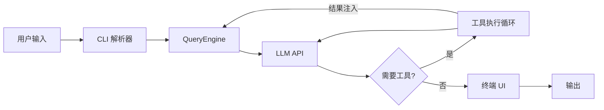
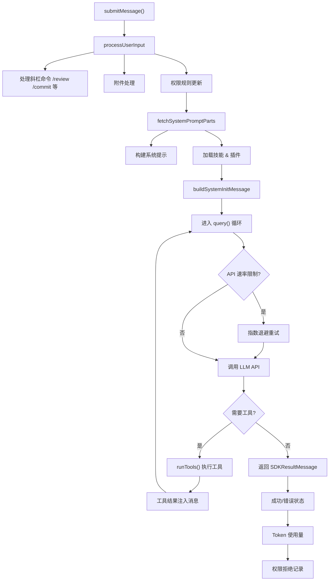
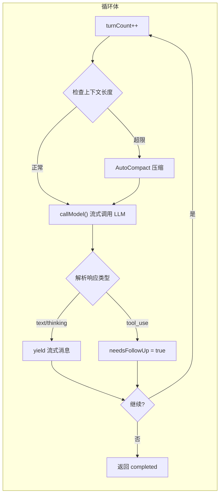
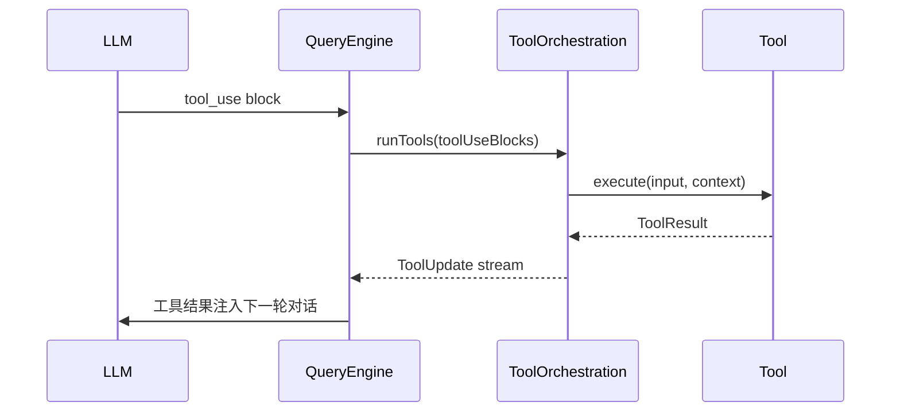
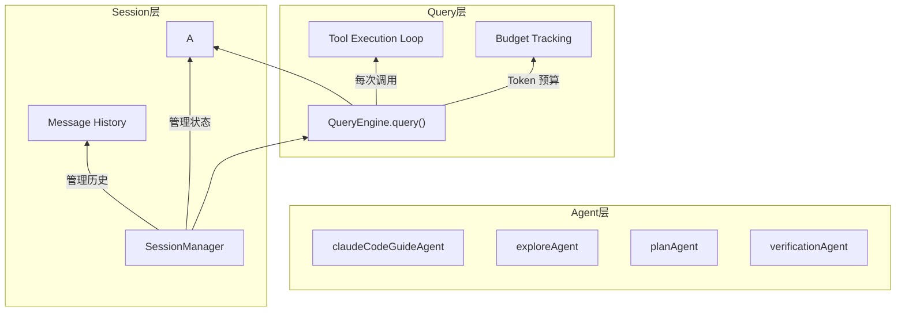
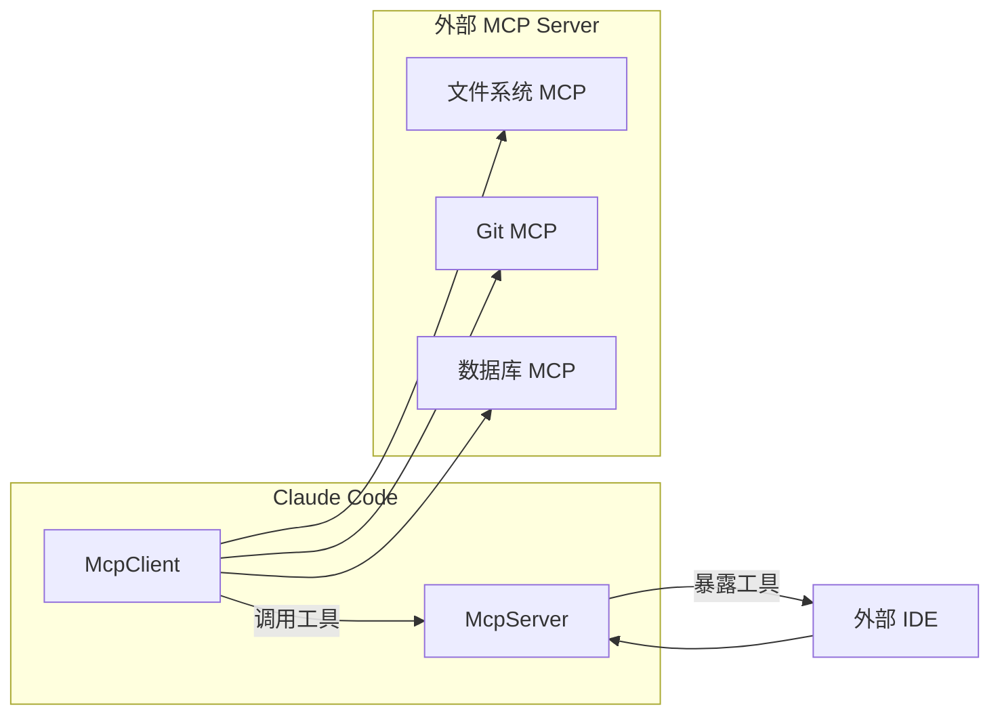

## 一、整体架构概览

Claude Code 是一个基于终端的 AI 编程助手，采用**管道模型**：



整个项目规模庞大：
- **~1,900 个文件**
- **512,000+ 行 TypeScript 代码**
- 使用 **Bun** 作为运行时
- UI 层基于 **React + Ink**（React 的终端版本）

### 关键目录结构

```
src/
├── QueryEngine.ts       # 核心引擎 (~46K 行)
├── query.ts             # 查询循环实现 (~67K 行)
├── Tool.ts              # 工具基类 (~28K 行)
├── main.tsx             # CLI 入口 (~800K)
├── tools/               # 所有工具实现 (~40+ 工具)
├── commands/            # 斜杠命令系统
├── bridge/              # IDE 桥接层 (VS Code/JetBrains)
├── services/            # 服务层
│   ├── api/            # Anthropic API 客户端
│   ├── mcp/             # MCP 协议客户端
│   ├── compact/         # 对话压缩
│   └── ...
├── entrypoints/         # 入口点 (CLI/SDK/MCP)
└── server/              # Web 服务器
```

## 二、QueryEngine 详解

### 2.1 核心定位

`QueryEngine` 是 Claude Code 的**心脏**，它管理整个对话生命周期——从接收用户输入到流式返回响应，再到工具调用循环。

**文件位置**: `src/QueryEngine.ts` (~1,300 行核心代码，不含 query.ts)

### 2.2 类结构

```typescript
export class QueryEngine {
  private config: QueryEngineConfig        // 配置
  private mutableMessages: Message[]        // 可变消息历史
  private abortController: AbortController   // 中断控制器
  private permissionDenials: SDKPermissionDenial[]  // 权限拒绝记录
  private totalUsage: NonNullableUsage       // 总使用量统计
  private readFileState: FileStateCache     // 文件读取缓存
  private discoveredSkillNames: Set<string> // 发现的技能
  private loadedNestedMemoryPaths: Set<string>  // 加载的嵌套内存路径

  async *submitMessage(prompt, options): AsyncGenerator<SDKMessage>
  interrupt(): void
  getMessages(): readonly Message[]
  getReadFileState(): FileStateCache
  getSessionId(): string
  setModel(model: string): void
}
```

### 2.3 submitMessage 执行流程



### 2.4 查询循环 (query.ts)

`src/query.ts` (~1,731 行) 是 QueryEngine 的核心，包含**真正的 LLM 调用循环**：



```typescript
export async function* query(
  params: QueryParams,
): AsyncGenerator<StreamEvent | Message | Terminal> {
  // 循环状态
  let state: State = {
    messages: params.messages,
    toolUseContext: params.toolUseContext,
    autoCompactTracking: undefined,
    maxOutputTokensRecoveryCount: 0,
    turnCount: 1,
    // ...
  }

  while (true) {
    // 1. 上下文压缩检查
    const { compactionResult } = await deps.autocompact(...)

    // 2. 调用 LLM API (流式)
    for await (const message of deps.callModel({...})) {
      // 处理 text, thinking, tool_use 块
      yield message
    }

    // 3. 工具执行循环
    if (needsFollowUp) {
      for await (const update of runTools(...)) {
        yield update.message
      }
    }

    // 4. 检查终止条件
    if (!needsFollowUp) {
      return { reason: 'completed' }
    }

    // 5. 循环继续
    state = { ...state, turnCount: state.turnCount + 1 }
  }
}
```

### 2.5 关键设计模式

#### 1. **AsyncGenerator 模式**

QueryEngine 使用 `AsyncGenerator` 实现**流式响应**：

```typescript
async *submitMessage(prompt): AsyncGenerator<SDKMessage> {
  // 每次 LLM 输出一个 content block 就 yield
  for await (const message of query({...})) {
    yield normalizeMessage(message)  // 实时流式返回
  }
  yield { type: 'result', ... }  // 最终结果
}
```

#### 2. **工具调用循环**

当 LLM 返回 `tool_use` 块时，进入工具执行阶段：



```typescript
// 从流中提取 tool_use 块
const toolUseBlocks = message.message.content.filter(
  c => c.type === 'tool_use'
) as ToolUseBlock[]

// 执行工具
const toolUpdates = runTools(toolUseBlocks, ...)

// 将结果注入下一轮对话
messagesForQuery = [...messagesForQuery, ...assistantMessages, ...toolResults]
```

#### 3. **错误恢复机制**

QueryEngine 实现了**多层错误恢复**：

| 错误类型 | 恢复策略 |
|---------|---------|
| API 速率限制 | 指数退避重试 |
| 模型降级 | 自动切换到 fallback 模型 |
| Prompt 太长 | 触发上下文压缩 (AutoCompact) |
| Max Output Tokens | 自动扩展到 64k |
| 工具权限拒绝 | 记录并跳过 |

#### 4. **上下文压缩 (AutoCompact)**

当对话过长时，自动压缩历史消息：

```typescript
const { compactionResult } = await deps.autocompact(
  messagesForQuery,
  toolUseContext,
  { systemPrompt, userContext, ... },
  querySource,
  tracking,
  snipTokensFreed,
)

// 压缩后继续对话
messagesForQuery = postCompactMessages
```

### 2.6 配置选项

QueryEngine 接受丰富的配置：

```typescript
export type QueryEngineConfig = {
  cwd: string
  tools: Tools
  commands: Command[]
  mcpClients: MCPServerConnection[]
  agents: AgentDefinition[]
  canUseTool: CanUseToolFn
  initialMessages?: Message[]
  readFileCache: FileStateCache
  customSystemPrompt?: string
  appendSystemPrompt?: string
  userSpecifiedModel?: string
  fallbackModel?: string
  thinkingConfig?: ThinkingConfig
  maxTurns?: number
  maxBudgetUsd?: number
  taskBudget?: { total: number }
  jsonSchema?: Record<string, unknown>
  verbose?: boolean
  replayUserMessages?: boolean
  includePartialMessages?: boolean
  setSDKStatus?: (status: SDKStatus) => void
  abortController?: AbortController
  orphanedPermission?: OrphanedPermission
  snipReplay?: SnipReplayFn  // 历史裁剪回调
}
```

## 三、三层架构：Agent / Session / Query

Claude Code 的会话模型分为三层：



### 3.1 Agent 层 (`src/tools/AgentTool/`)

Agent 是**可复用的子任务执行单元**：

```typescript
// 内置 Agent 类型
export type BuiltInAgentDefinition = {
  source: 'built-in'
  getSystemPrompt: (params) => string
  callback?: () => void
}

// 自定义 Agent (从 .md 文件加载)
export type CustomAgentDefinition = {
  source: 'user' | 'project' | 'policySettings'
  getSystemPrompt: () => string
  filename?: string
  baseDir?: string
}
```

**内置 Agent**：
- `claudeCodeGuideAgent` - Claude Code 使用指南
- `exploreAgent` - 代码探索
- `planAgent` - 任务规划
- `verificationAgent` - 代码验证

### 3.2 Session 层

Session 管理**会话状态和历史**：

```typescript
// SessionStore - Web 服务器端会话管理
export class SessionManager {
  private store: SessionStore
  private maxSessions: number
  private rateLimiter: UserHourlyRateLimiter

  create(ws, cols, rows, user?): string | null
  resume(token, ws, cols, rows): boolean
  destroySession(token): void
}
```

### 3.3 Query 层

Query 是**单次 LLM 调用的完整生命周期**：

- 从用户输入到最终响应
- 包含工具调用循环
- 管理 Token 使用和预算
- 处理错误和恢复

## 四、工具系统

### 4.1 工具定义

```typescript
// src/Tool.ts
export type Tool = {
  name: string
  description: string
  inputSchema: ZodSchema
  permissionModel: PermissionModel
  execute: (input, context) => Promise<ToolResult>
  render?: (input, result) => React.ReactNode
  isConcurrencySafe?: () => boolean
}
```

### 4.2 工具执行

```typescript
// src/services/tools/toolOrchestration.ts
export async function* runTools(
  toolUseBlocks: ToolUseBlock[],
  assistantMessages: AssistantMessage[],
  canUseTool: CanUseToolFn,
  toolUseContext: ToolUseContext,
): AsyncGenerator<ToolUpdate>
```

## 五、MCP (Model Context Protocol)

Claude Code 同时是 **MCP Client** 和 **MCP Server**：



```typescript
// Client: 消费外部 MCP 工具
export class McpClient {
  async connect(config: McpServerConfig): Promise<void>
  async listTools(): Promise<McpTool[]>
  async callTool(name: string, args: object): Promise<ToolResult>
}

// Server: 暴露 Claude Code 工具给外部
// src/entrypoints/mcp.ts
export async function startMcpServer() {
  // 实现 MCP 协议
}
```

## 六、权限系统

Claude Code 实现了**集中式权限管理**：

```typescript
// 权限模式
export type PermissionMode =
  | 'default'      // 每个操作都询问
  | 'plan'         // 一次询问整个执行计划
  | 'bypassPermissions'  // 自动批准 (危险)
  | 'auto'         // ML 分类器自动决策

// 权限规则示例
Bash(git *)           // 允许所有 git 命令
FileEdit(/src/*)      // 允许编辑 src 目录
```

## 七、状态管理

使用 **React Context + 自定义 Store** 模式：

```typescript
// 全局状态
export type AppState = {
  toolPermissionContext: ToolPermissionContext
  fileHistory: FileHistoryState
  attribution: AttributionState
  mcp: McpState
  // ...
}

// Context Providers
export const NotificationContext = createContext<NotificationContext>(null)
export const OverlayContext = createContext<OverlayContext>(null)
```

## 八、构建系统

### 8.1 特性开关 (Dead Code Elimination)

```typescript
import { feature } from 'bun:bundle'

if (feature('VOICE_MODE')) {
  const voiceCommand = require('./commands/voice/index.js').default
}
```

### 8.2 懒加载

```typescript
// 重量级模块延迟加载
const reactiveCompact = feature('REACTIVE_COMPACT')
  ? require('./services/compact/reactiveCompact.js')
  : null
```

## 总结

Claude Code 的架构设计体现了几个核心原则：

1. **流式优先** - AsyncGenerator 模式让响应实时可见
2. **容错设计** - 多层错误恢复保证对话不中断
3. **可扩展性** - 工具、Agent、命令都支持插件化
4. **资源管理** - Token 预算和上下文压缩控制成本
5. **模块化** - 清晰的层次划分 (Agent → Session → Query)


