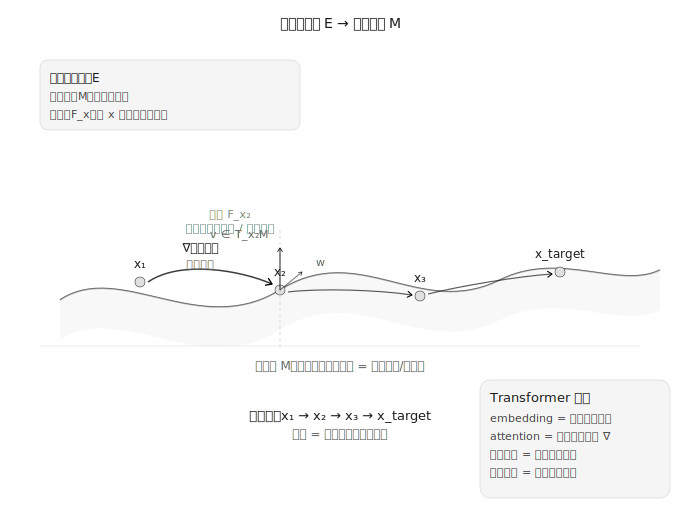

大语言模型在海量语料上训练后，展现出了惊人的推理能力：数学推导、类比推理、因果判断、多步逻辑链——这些能力并非被显式编程，而是从单纯的「预测下一个词」中涌现出来的。这引出一个根本性问题：推理结构是不是本来就存在，训练只是把它「学出来」？

要回答这个问题，需要先理解数据本身的形态。高维数据（语言、图像）并非均匀分布在整个空间中——流形假设告诉我们，自然语言的所有合法句子只是高维空间中的一个薄薄的曲面。原始空间的维度可能大得离谱（词表大小五万），但语义流形 M 的实际维度远远小于此。训练的本质，就是把随机初始化造成的那块扭曲、断裂的流形「拉直」，让语义相近的点在流形上彼此靠近。推理本质上就是在这块学得的流形上做测地线移动——这也是为什么 `king - man + woman ≈ queen` 这类类比推理能在词向量空间中直接做向量运算，因为语义流形上的代数结构被学到了。

但这里有一个关键跳跃。只说「语义空间是流形」还不够——它只解释了概念在哪里，没解释概念之间怎么走。我们需要一个更丰富的结构。

在微分几何中，纤维丛由三层东西构成：底流形 M 是所有概念的连续空间；在每个点 x 上附加一个纤维 F_x，它是 x 处的局部推理规则——比如从「苹果」这个概念出发，有哪些合理的推理路径可以走（是水果、可以吃、和橘子是同类）；整体 E 则是完整认知状态的空间。在这个框架下，「推理」不再是模糊的心理活动，而是一个精确的几何操作：给定当前概念 x 和上下文给出的方向，联络 ∇ 告诉你下一步应该移动到哪个概念 y，以及 y 处的推理结构是什么。

Transformer 的 attention 机制恰好对应了这个几何结构。每个 token 的 embedding 是底流形上的一个点；Query/Key/Value 是在该点定义局部切空间的线性映射；multi-head attention 意味着同时考虑多个方向的联络系数；而残差连接则保持了底流形上的基点不变、只更新纤维方向。深层网络中每一层的 `x_{l+1} = x_l + Attention(x_l)` 就是在语义流形上沿着学到的联络走一步，L 层就是走了 L 步。

到目前为止，我们只是建立了类比。一个自然的追问是：这套几何结构的存在有数学依据吗？Kolmogorov-Arnold 表示定理给出了一个方向：任意多元连续函数都可以分解为一元函数 + 加法的组合——这与深层网络逐层做「一元变换 + 加法组合」的结构高度相似。但必须诚实地说，这个类比并不严格——Girosi & Poggio 在 1989 年就指出 KART 中的内层函数极其崎岖、不是神经网络能有效学习的光滑函数。真正为深度学习提供理论基础的是后来的通用逼近定理，而非 KART。这里的引用更多是一个直观提示：深层网络做的事，在数学上确实对应某种逐层分解的几何结构。

这套几何框架接下来需要处理一个更深层的追问：它描述的结构，是先验的还是涌现的？

世界本身的逻辑提供了底层约束——因果关系、类比关系、否定关系不是任意的，不同语言和文化中的基础推理结构高度相似。从这个角度看，语义流形有先验的一面，训练是用有限数据去逼近一个预先存在的结构。但另一方面，对抗样本的存在表明流形可以很脆弱，不同初始化和数据分布确实会塑造出不同形状的流形——具体领域的语义几何，明显是涌现的。合理的判断是：底层逻辑结构偏先验，具体流形形状偏涌现，中间的概念关系则两者各半。

更有意思的是，这个框架能解释几个当前 LLM 的关键现象。

为什么链式逐步推理会自发出现？考虑题目「若 x + 1/x = 5，求 x² + 1/x²」。直接回答需要从题目 token 一步跳到答案「23」——这在流形上是一个大距离跨越，很多模型会给出「25」或「21」这类错误答案，因为跳偏了。而逐步推理是沿着测地线分步投影：先识别 (x + 1/x)² = x² + 2 + 1/x²，再推导 x² + 1/x² = (x + 1/x)² - 2，最后代入 5² - 2 = 23。每一步都是在流形上的小步，不易偏离。模型不是因为被教了「要写步骤」才这么做——是 predict next token 这个训练目标，在几何上等价于要求模型在流形上找到最短路径，而分步走比跳更稳定。

为什么上下文学习有效？当你给模型几个 few-shot 例子——比如两组建模「每一项乘 2」的序列——模型并没有更新参数，但注意力机制用这几条路径估计出了「乘 2」这个局部联络系数，然后对新的查询应用这个联络。注意力机制本质上就是在用上下文估计联络。

为什么思维链比直接回答更准？Roger 有 5 个网球、又买了 2 筒每筒 3 个、他现在有几个球——直接跳到 `5 + 2×3 = 11` 可能在流形上跨越一个「山谷」，掉进对「筒」的误解。而分步骤走（原有 5 个 → 2×3 = 6 个新球 → 5+6 = 11），每步的测地线距离都短，流形的局部拓扑更平坦。

这套框架目前还只是概念性的。如果认真对待，有三个开放问题值得深入。第一是联络的唯一性——同一个底流形上可以有无穷多个联络，不同训练过程学到的「推理风格」是否可以用联络的选择来解释？更激进地问：模型的「人格」是不是就是联络的选择？第二是流形的拓扑不变量——语义空间中是否真的只有一个连通分支（任意两个概念都能通过推理链连接）？是否存在不可收缩的推理环路，比如 A → B → C → A 对应某种语义悖论？第三是可解释性的几何基础——如果推理错误就是走错了路径，能否通过直接干预 attention weight（纠正联络）把模型从错误路径上拉回到正确路径？

从实验角度看，这些问题并不是纯思辨。用 PCA 或 t-SNE 把中间层的表示投影到低维空间，就可以看到模型在语义流形上的「推理轨迹」——思维链的轨迹应该更平滑。测量不同模型 attention 矩阵的 Frobenius 距离，与它们的推理风格差异做相关分析，可以初步检验「联络 = 推理风格」的猜想。而最直接的是干预实验：对于模型常犯的推理错误，手动修改责任最大的 attention head 的权重，观察模型输出是否从错误变成了正确——如果可行，「可控推理」就有了原理性依据。

回到最初的问题：推理能力为什么从数据训练中涌现？从几何角度看，语义空间本来就有流形结构，训练在这个结构上学会了一套联络，而推理就是沿着这套联络在流形上移动。底层逻辑是先验的，但联络的确切形态是涌现的。就像 Hilbert 空间是量子力学的自然语言一样——纤维丛几何，可能就是认知的自然语言。

---

**参考文献**

1. Kolmogorov, A. N. (1956). *On the representation of continuous functions of several variables*. Doklady Akademii Nauk SSSR.
2. Arnold, V. I. (1957). *On functions of three variables*. Doklady Akademii Nauk SSSR.
3. Hecht-Nielsen, R. (1987). *Kolmogorov's mapping neural network existence theorem*. IEEE ICNN.
4. Girosi, F., & Poggio, T. (1989). *Representation properties of networks: Kolmogorov's theorem is irrelevant*. Neural Computation.
5. Kůrková, V. (1991). *Kolmogorov's theorem is relevant*. Neural Computation.
6. Cybenko, G. (1989). *Approximation by superpositions of a sigmoidal function*. Mathematics of Control, Signals, and Systems.
7. Hornik, K. (1991). *Approximation capabilities of multilayer feedforward networks*. Neural Networks.
8. Liu, Z., et al. (2024). *KAN: Kolmogorov-Arnold Networks*. arXiv:2404.19756.
9. Edelsbrunner, H., & Harer, J. (2010). *Computational Topology: An Introduction*. AMS.
10. Bronstein, M. M., et al. (2017). *Geometric deep learning: going beyond Euclidean data*. IEEE Signal Processing Magazine.
