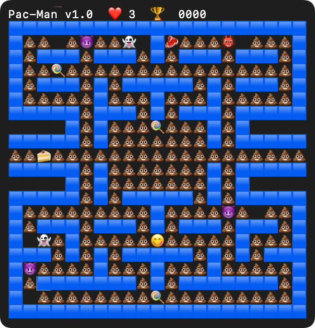

## 起因

几年前有天突然想看看 `termios` 这个库，就是 Unix 下控制终端原始模式的那个。关掉回显、关掉行缓冲、直接读按键码，是做终端交互程序的起点。然后就花了一晚上搞出个 emoji 版的 Pac-Man，因为规则简单、地图小，但该有的一样不少：实时输入、碰撞检测、AI 寻路、状态管理、画面渲染。一个小游戏把 TUI 的核心操作都覆盖了。今晚一时起意让 AI（WorkBuddy with GLM5.1）继续完善了下，补了下当年留的坑。



代码在 [GitHub](https://github.com/mivinci/pacman)，就一个 `pm.c`，`cc pm.c && ./a.out a.map` 即可开玩。

## 一开始的样子

能跑。有地图、有玩家、有鬼、有食物、有分数，方向键控制，吃完所有食物就赢。

但鬼很拉垮：

**贴墙鬼打墙。** 曼哈顿距离贪心寻路，墙挡在中间就在墙边来回抖。又蠢又搞笑。

**所有鬼走同一条路。** 目标一样、算法一样，鬼排成一串，后面的直接冻住。

**假难度。** `rand() % 2` 随机跳过移动，不是更聪明，只是更慢。

## 这次改了啥

### 鬼：BFS + 性格

把曼哈顿贪心换成了 BFS。BFS 找的是真正的最短路径，不会再贴墙抖了。地图最大 420 格，一次 BFS 零开销。

然后给每只鬼加了性格：

| 鬼 | 干啥 |
|---|---|
| 😈 | BFS 直奔玩家 |
| 👻 | BFS 奔向玩家前方 4 格 |
| 👹 | 30% 追玩家，70% 随机走 |

鬼分散在不同路径上，围堵的模式自然多了。调速也从 `rand() % 2` 改成了帧计数——每只鬼有个 `speed`，每隔几帧动一次，确定、可调。

### Power-up

地图里散着 🍭，吃到之后：

- 鬼全部 😰 恐慌，从 BFS 追击切换成 BFS 逃跑（同一个算法反过来用）
- 玩家可以吃恐慌鬼，200 分一只
- 被吃的鬼从地图上消失，内部 BFS 回家，到了复活
- 玩家变成 😍，结束后恢复 😋

右上角 💪 显示倒计时。

### 固定帧率

原版是按键驱动：按一次键调一次游戏逻辑。结果就是按键越快 tick 走得越快，power-up 倒计时也跟着加速……改成了 16Hz 固定帧率，按键缓冲到 `pending_key`，只在 tick 到期时处理：

```c
while (1) {
    gettimeofday(&now, NULL);
    long wait_us = TICK_US - elapsed_us;
    select(1, &_rfds, NULL, NULL, &timeout);
    if (有输入) pending_key = readkey();

    if (elapsed_us < TICK_US) continue;
    next(&p, pending_key);
    pending_key = KEY_NULL;
}
```

游戏速度和输入解耦了，按键快慢不影响倒计时。

### 帧差分的坑

这是这次改的过程中踩得最深的坑，值得单独说说。

先解释下帧差分是怎么工作的。游戏有两份缓冲区：`buf` 存当前帧每个格子的字符，`prev` 存上一帧的字符。渲染时遍历所有格子，比较 `buf` 和 `prev`：字符一样就跳过，不一样就移动光标、重绘那个格子。然后把 `buf` 复制到 `prev`，等下一帧再比。

```
buf:  . A . .     prev: . A . .     diff: 没变化，跳过
      . . . B           . . . B
```

```
buf:  . . . .     prev: . A . .     diff: (1,0) 变了，重绘
      . . A B           . . . B           (2,1) 变了，重绘
```

正常情况下很好用：玩家走一步，只有新旧两个格子变了；鬼走一步，也只变两个格子。每帧重绘 4-8 个格子，比起全刷 420 个格子省了两个数量级。

**但问题出在「字符」和「状态」不是一回事。**

buffer 里存的是字符——`A` 就是鬼 A，`.` 就是玩家。但渲染的时候，同一个字符 `A` 在不同状态下要画成不同的 emoji：正常是 😈，恐慌是 😰，被吃是隐形。这个状态存在 `ghost.flag` 里，不在 buffer 里。

所以当鬼从正常变恐慌，`buf` 里的字符还是 `A`，`prev` 里的字符也还是 `A`，差分一比——`A == A`，没变化，跳过。画面上鬼还是 😈，但实际应该是 😰。看起来就是「鬼不变」。

解决办法是 `invalidate_cell`：在 ghost flag 变化的地方，手动把 `prev` 对应位置写成一个不可能出现的值（`0xFF`），让差分一定判定为「变了」：

```c
#define invalidate_cell(p, x, y) ((p)->prev[(y) * (p)->w + (x)] = 0xFF)
```

相当于告诉渲染器：这个格子脏了，不管字符变没变都重画。

需要加 `invalidate_cell` 的地方有：

- power-up 开始，鬼变恐慌
- 玩家吃掉恐慌鬼，鬼变 eaten
- power-up 结束，鬼恢复正常
- eaten ghost 到家复活
- power-up 开始/结束，玩家 emoji 变化

漏一处就是一个「状态变了但画面没更新」的 bug。这个 bug 被报了两次，每次都是漏了一处 `invalidate_cell`。

本质上这是帧差分渲染的一个经典问题：**差分比较的是数据，但渲染依赖的是数据+状态**。当状态变化不影响数据时，差分就瞎了。游戏引擎里类似的问题用「脏标记」（dirty flag）解决，`invalidate_cell` 就是手动打脏标记。

### 状态栏

Header 显示 `Pac-Man v1.0  ❤️ 3  🏆 0120`，power-up 右上角 `💪 15`。

有个小坑：❤ (U+2764) 默认白色，得加 U+FE0F 变体选择符才变红。6 字节 emoji，少一个字节颜色就不对。

### 地图配置

5 张地图，每张 3-5 个 🍭。支持 `!` 开头的配置行覆盖鬼的参数：

```
! A 6 chase
! B 8 ambush
! C 8 random
```

不同地图不同难度。

## 还能怎么搞

这项目现在能玩了，但好玩的地方在于还能继续折腾：

**更多鬼。** 经典 Pac-Man 的 Inky 用玩家和追击鬼的位置做插值算目标点。加新性格就写一个算目标的函数，插进 switch 里。

**地图编辑器。** 地图现在是手写的文本文件，做个 TUI 编辑器不难，反正 `termios` 和帧差分都有了。

**双人。** 一个 WASD 一个方向键，第二个玩家就是另一个 PLAYER 符号。

**AI 玩家。** 用同样的 BFS 框架就能写个自动玩家——吃最近的食物、躲最近的鬼、power-up 时追鬼。然后让两套 AI 参数对战跑 100 局看胜率，突然就变成强化学习实验平台了。

**让 LLM 来玩。** 把游戏状态实时喂给 LLM，让它当解说员——「玩家刚吃下糖果，三只鬼进入恐慌……」或者让 LLM 操控其中一只鬼，看它和人写的 BFS 比怎么样。甚至可以让 LLM 生成地图，给个连通性和食物密度的约束就行。

写着玩的玩具，但还有折腾空间，下次无聊再说。
